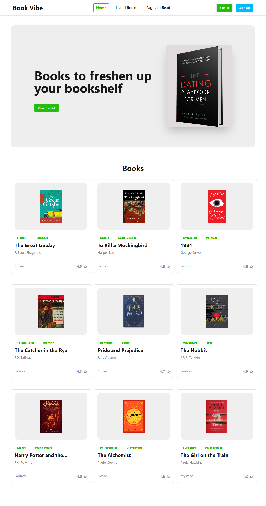

# 📚 Book Vibe



Book Vibe is a responsive web application that helps users discover books, view detailed information, and manage their reading journey by adding books to a Read List or Wishlist.

## 🔗 Live Demo

- Live Site: https://book-vibe-react-router-project.netlify.app/

## ✨ Features

- Browse books from local JSON data
- View detailed information about each book
- Add books to Read List
- Add books to Wishlist
- Prevent duplicate additions
- Sort books by rating
- Sort books by total pages
- Toast notifications for user actions
- Custom 404 page
- Fully responsive design

## 🛠️ Technologies Used

- React
- React Router DOM
- JavaScript (ES6)
- Tailwind CSS
- DaisyUI
- React Toastify
- React Tabs
- Local Storage

## 📂 Folder Structure

```bash
src
├── Components
├── Pages
├── Routes
├── Utilities
├── assets
├── App.jsx
└── main.jsx
```

## ⚙️ Installation

Clone the repository:

```bash
git clone https://github.com/rashedulislam595/book-vibe.git
```

Go to the project directory:

```bash
cd book-vibe
```

Install dependencies:

```bash
npm install
```

Run the development server:

```bash
npm run dev
```

## 📱 Responsive Design

The application is optimized for:

- Mobile Devices
- Tablets
- Laptops
- Desktop Devices

## 👨‍💻 Developer

**Md Rashedul Islam Rashed**

GitHub: https://github.com/rashedulislam595